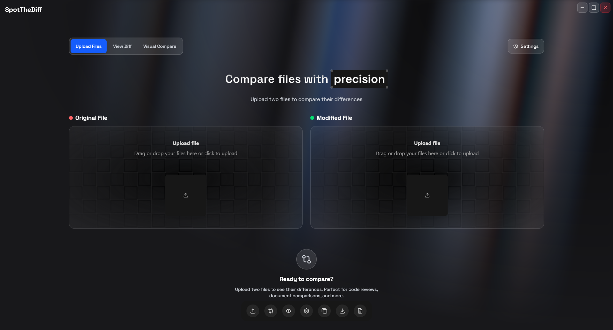

# SpotTheDiff

A modern, cross-platform desktop application for comparing files and visualizing differences with a beautiful, intuitive interface.



## Features

- **File Comparison**: Compare any two text files side-by-side or in unified view
- **Multiple File Types**: Support for code files, images, archives, and more
- **Visual Diff**: Highlighted differences with syntax highlighting
- **Drag & Drop**: Easy file upload with drag and drop interface
- **Export Options**: Copy differences to clipboard or download diff files
- **Customizable**: Toggle line numbers, whitespace handling, and view modes
- **Modern UI**: Beautiful dark theme with smooth animations
- **Cross-Platform**: Works on Windows, macOS, and Linux

## Demo

https://github.com/yourusername/SpotTheDiff/assets/youruserid/spotthediff.mp4

## Getting Started

### Prerequisites

- [Node.js](https://nodejs.org/) (v18 or higher)
- [Rust](https://rustup.rs/) (for Tauri backend)
- [npm](https://www.npmjs.com/) or [yarn](https://yarnpkg.com/)

### Installation

1. **Clone the repository**
   ```bash
   git clone https://github.com/yourusername/SpotTheDiff.git
   cd SpotTheDiff
   ```

2. **Install dependencies**
   ```bash
   npm install
   ```

3. **Run in development mode**
   ```bash
   npm run tauri dev
   ```

### Building for Production

```bash
npm run tauri build
```

The built application will be available in the `src-tauri/target/release` directory.

## Tech Stack

- **Frontend**: React 19 + TypeScript + Vite
- **Backend**: Rust + Tauri 2
- **UI**: Tailwind CSS + Framer Motion
- **File Processing**: diff.js + highlight.js
- **Icons**: Lucide React

## Project Structure

```
SpotTheDiff/
├── src/                    # React frontend source
│   ├── components/         # UI components
│   ├── lib/               # Utility functions
│   └── App.tsx           # Main application component
├── src-tauri/             # Rust backend
│   ├── src/              # Rust source code
│   └── tauri.conf.json   # Tauri configuration
├── public/               # Static assets
└── package.json          # Node.js dependencies
```

## Usage

1. **Launch the application**
2. **Upload files** by dragging and dropping or clicking the upload areas
3. **Compare files** - the app will automatically detect differences
4. **Customize view** using the settings panel:
   - Toggle line numbers
   - Ignore whitespace changes
   - Switch between unified and side-by-side views
5. **Export results** by copying to clipboard or downloading

## Configuration

The application can be customized through the settings panel:

- **Line Numbers**: Show/hide line numbers in the diff view
- **Whitespace**: Ignore whitespace changes when comparing
- **View Mode**: Choose between unified and side-by-side diff views
- **Theme**: Dark theme optimized for code readability

## Available Scripts

- `npm run dev` - Start development server
- `npm run build` - Build for production
- `npm run tauri dev` - Run Tauri in development mode
- `npm run tauri build` - Build Tauri application
- `npm run preview` - Preview production build

## Contributing

Contributions are welcome! Please feel free to submit a Pull Request.

1. Fork the repository
2. Create your feature branch (`git checkout -b feature/AmazingFeature`)
3. Commit your changes (`git commit -m 'Add some AmazingFeature'`)
4. Push to the branch (`git push origin feature/AmazingFeature`)
5. Open a Pull Request

## License

This project is licensed under the MIT License - see the [LICENSE](LICENSE) file for details.

## Acknowledgments

- Built with [Tauri](https://tauri.app/) for cross-platform desktop apps
- UI components powered by [Tailwind CSS](https://tailwindcss.com/)
- Animations by [Framer Motion](https://www.framer.com/motion/)
- File diffing with [diff.js](https://github.com/kpdecker/jsdiff)

---

**SpotTheDiff** - Making file comparison beautiful and intuitive.
